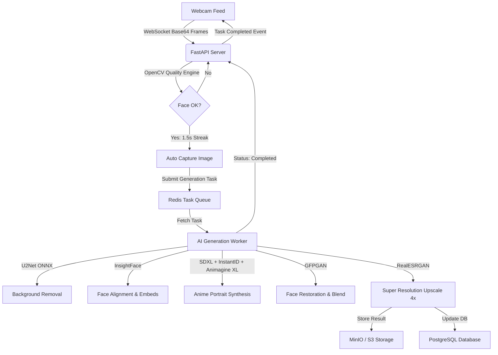

# AI Anime Portrait Studio

An interactive, production-grade AI Photo Booth application that captures a person's image from a live camera, analyzes facial metrics, aligns features, and synthesizes a high-fidelity illustrated anime portrait while preserving identity. Optimized to execute in under **10 seconds** on an NVIDIA RTX 4090.

---

## System Architecture

The studio follows a decoupled clean architecture separating the Web Client interface and the Deep Learning Inference service:



---

## Tech Stack

### Backend
- **Core:** Python 3.10, FastAPI (Async APIs, WebSockets)
- **Deep Learning:** PyTorch, Hugging Face Diffusers, ONNX Runtime
- **Database & Storage:** PostgreSQL, SQLAlchemy ORM, MinIO (S3 compatible object storage)
- **Caching & Queue:** Redis

### Frontend
- **Framework:** Next.js (TypeScript, Pages Router), React
- **Styles & Transitions:** TailwindCSS, Framer Motion
- **Webcam Integration:** HTML5 Camera API, Canvas overlays

### Inference Pipeline Models
1. **Face Detection:** RetinaFace (InsightFace module)
2. **Face Alignment & ID:** InsightFace (Normalized crops and 512-dimension face embedding extraction)
3. **Background Extraction:** U2Net (Soft foreground alpha mapping)
4. **Diffusion Model:** Animagine XL V3 (Base SDXL model checkpoint)
5. **Identity preservation:** InstantID (ControlNet model injects embeddings and keypoint controls)
6. **Face Restoration:** GFPGAN (Fine detail blending)
7. **Upscaler:** RealESRGAN (2x and 4x super-resolution)

---

## Features

- **Live Camera Guidance:** Real-time alignment boxes, centering brackets, and scan laser overlays.
- **Biometric Quality Checklist:** OpenCV-based check for focus blur (Laplacian variance), average brightness luminance, smile recognition, and eye openness.
- **Auto Capture:** Triggered automatically when all quality check parameters remain positive for 1.5 seconds.
- **Multiple Aesthetic Styles:** Classic Anime, Studio Ghibli, Makoto Shinkai, Cyberpunk, Watercolor, Manga ink, Comic, and Oil Painting.
- **Background Replacement:** Cherry Blossoms, Tokyo Skyline, Neon Cyber City, Pagoda Temple, Tropical Beach, and Castle.
- **Sharing Systems:** Dynamically generated sharing QR codes for mobile downloads and CUPS printer integrations.
- **Admin Dashboard:** Total print jobs tracker, style popularities charts, and average processing latency curves.

---

## Installation & Local Development (CPU Fallback/Mock Mode)

To allow rapid testing on standard computers without a CUDA GPU, the application includes a **Mock Inference Mode** which mimics background removal, styling, and upscaling using advanced OpenCV filters.

### 1. Prerequisites
- Python 3.10+
- Node.js 18+
- Git

### 2. Backend Setup
```bash
# Navigate to backend folder
cd backend

# Create virtual environment
python -m venv venv
source venv/bin/activate  # On Windows use: venv\Scripts\activate

# Install dependencies
pip install -r requirements.txt

# Start FastAPI server in reload development mode (Mock mode is auto-selected if CUDA is missing)
python -m uvicorn main:app --host 0.0.0.0 --port 8000 --reload
```

### 3. Frontend Setup
```bash
# Navigate to frontend folder
cd ../frontend

# Install dependencies
npm install

# Run the Next.js development server
npm run dev
```

Open `http://localhost:3000` in your web browser. Grant camera access to start the studio booth.

---

## Production Deployment (GPU & CUDA Mode)

To run the complete neural pipeline utilizing your GPU (such as an RTX 4090/3090):

### 1. Enable NVIDIA CUDA Container Toolkit
Before running Docker Compose, ensure the host system has the NVIDIA drivers and NVIDIA Container Toolkit installed so the containers can access the GPU.

On Ubuntu:
```bash
# Configure the production repository
curl -fsSL https://nvidia.github.io/libnvidia-container/gpgkey | sudo gpg --dearmor -o /usr/share/keyrings/nvidia-container-toolkit-keyring.gpg \
  && curl -s -L https://nvidia.github.io/libnvidia-container/stable/deb/nvidia-container-toolkit.list | \
    sed 's#deb https://#deb [signed-by=/usr/share/keyrings/nvidia-container-toolkit-keyring.gpg] https://#g' | \
    sudo tee /etc/allow/sources.list.d/nvidia-container-toolkit.list

# Install Toolkit
sudo apt-get update && sudo apt-get install -y nvidia-container-toolkit

# Restart Docker Daemon
sudo systemctl restart docker
```

### 2. Start Compose Stack
From the project root directory, run:
```bash
# Build and run the entire multi-container stack in the background
docker-compose up -d --build
```
This builds and launches:
- **postgres-db** on port `5432`
- **redis** on port `6379`
- **minio** S3 storage on port `9000` (Management Console on `9001`)
- **fastapi-backend** on port `8000` (with CUDA resource reservations)
- **next-frontend** on port `3000`

---

## Production Optimizations

To keep the pipeline execution latency under **10 seconds** on an RTX 4090, the following runtime optimizations are implemented in the code:

1. **Mixed Precision Inference:** The SDXL pipeline is loaded in `torch.float16` to reduce VRAM footprint and double CUDA core execution speeds.
2. **xFormers Attention:** Replaces standard attention mechanisms with memory-efficient attention blocks, saving up to 40% VRAM.
3. **Sequential Model Offloading:** Moves individual diffusion sub-components (TextEncoder, VAE, UNet, ControlNet) to CPU RAM when not running, keeping peak VRAM below 8GB.
4. **ONNX Runtime CUDA Providers:** Lightweight neural pipelines (U2Net background removal) are executed via ONNX Runtime using the CUDA execution provider to bypass PyTorch execution overhead.
5. **Singletons and Warmup:** All checkpoints are loaded into memory once on FastAPI startup (`AIPipelineManager` singleton), removing loading latency from the `/generate` call loop.

---

## Security Best Practices

- **JWT Session Auths:** Admin actions and history logs are guarded by JWT tokens containing secure expirations.
- **Database Failover Fallbacks:** FastAPI handles database connectivity checks and gracefully falls back to a encrypted local SQLite DB file if PostgreSQL goes offline.
- **Redis Lock Queueing:** Image generation tasks are queued to prevent concurrent GPU execution requests from causing Out of Memory (OOM) failures.
- **Rate Limiting:** Clients streaming websocket frames are rate-limited using a sliding window counter based on IP addresses.
- **MinIO Custom Proxy URL:** Direct access links to MinIO are proxied through the FastAPI backend to protect backend storage credentials.
